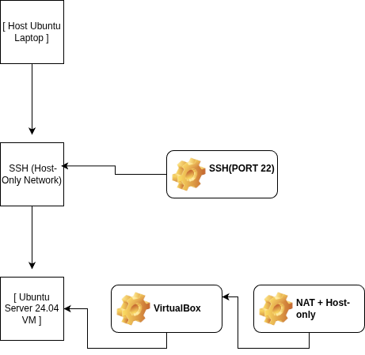
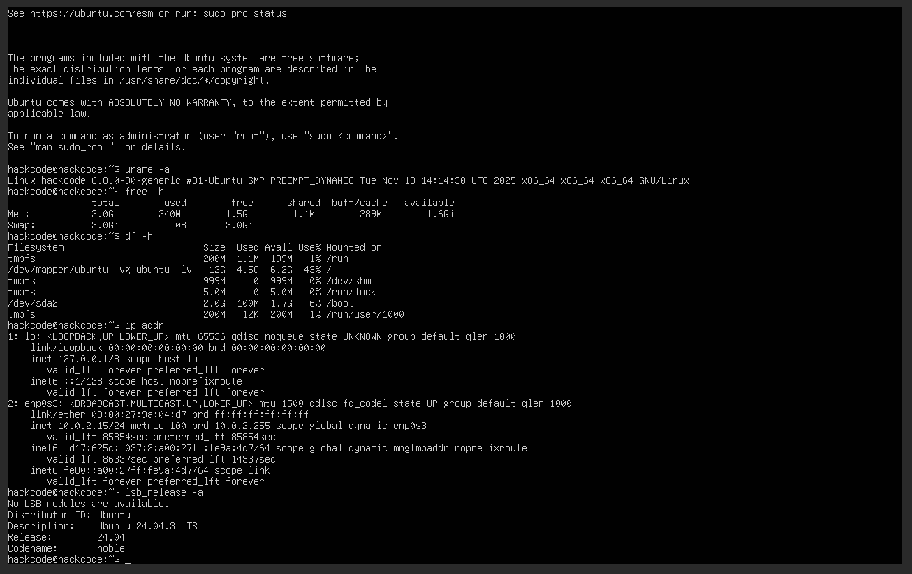

# Week 1 – System Planning and Distribution Selection

## Objectives
- Design a dual-system architecture
- Select and justify a Linux server distribution
- Document baseline system information using CLI tools

## System Architecture
The system consists of two machines:
- **Workstation:** Host Ubuntu laptop used for administration
- **Server:** Ubuntu Server 24.04 LTS running headless in VirtualBox

The server is accessed exclusively via SSH over a Host-Only network, enforcing command-line-only administration.


## System Architecture
For this coursework, I implemented a Management Plane / Data Plane separation model. This ensures that the server is treated as a remote resource, accessed exclusively via secure protocols rather than a local console.

Workstation (Administrative Node): My host machine (Ubuntu Linux) acts as the workstation. This allows for native integration with OpenSSH and provides a familiar environment for scripting and monitoring.

Server (Target Node): A VirtualBox VM running Ubuntu Server 24.04 LTS. It is configured as a "Headless" system (no Graphical User Interface), which significantly reduces the attack surface and preserves system resources for actual workloads.
## Distribution Selection Justification
Ubuntu Server 24.04 LTS was selected due to:
- Long-Term Support (5 years)
- Minimal installation footprint
- Strong security update ecosystem
- Extensive documentation and community support

Alternative distributions considered:
- **Debian:** Stable but slower update cycle
- **CentOS Stream:** Rolling updates not ideal for controlled environments

Ubuntu Server provides the best balance between stability, security, and usability.

## Workstation Configuration
The host Ubuntu system was chosen as the workstation (Option B) because:
- Native SSH client availability
- Direct integration with VirtualBox
- Simplified monitoring and scripting

## Network Configuration
VirtualBox network setup:
- Adapter 1: NAT (for internet access)
- Adapter 2: Host-Only Adapter (private management network)

Assigned IP addresses:
- NAT: 10.0.2.15
- Host-Only: 192.168.56.101

## System Specifications (CLI Evidence)

```bash
uname -a
free -h
df -h
ip addr
lsb_release -a
