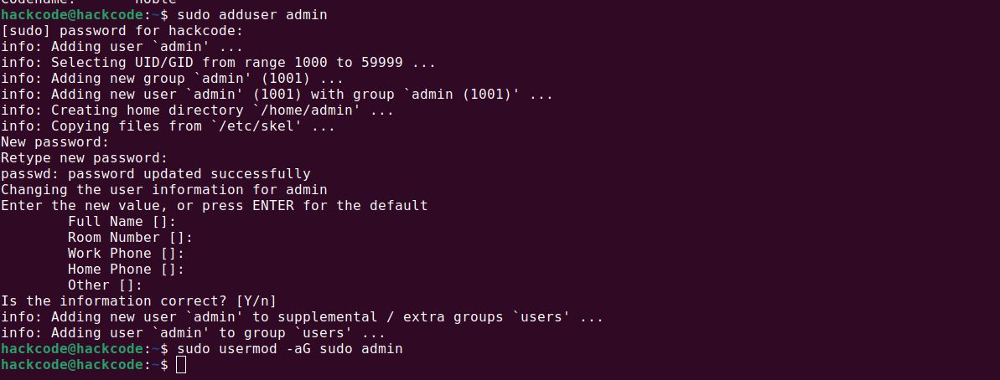
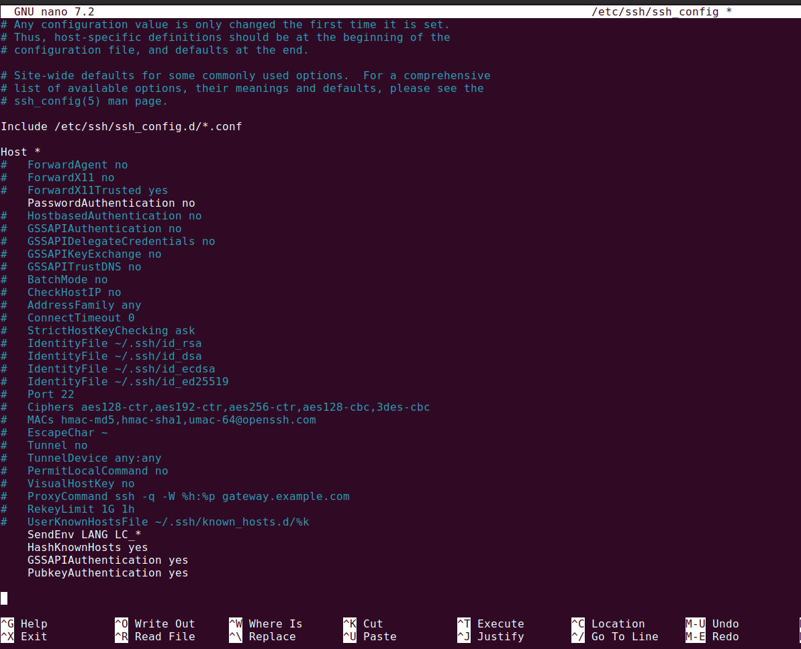
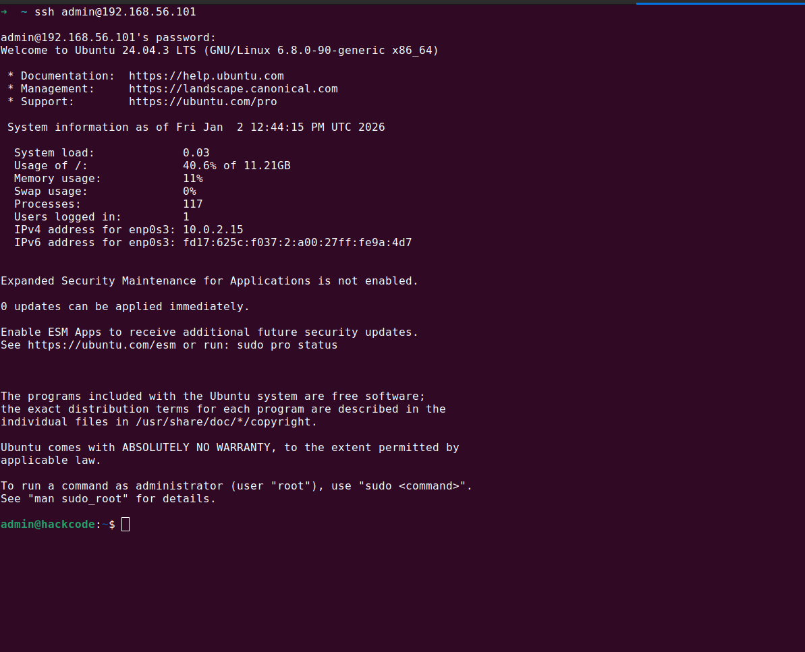
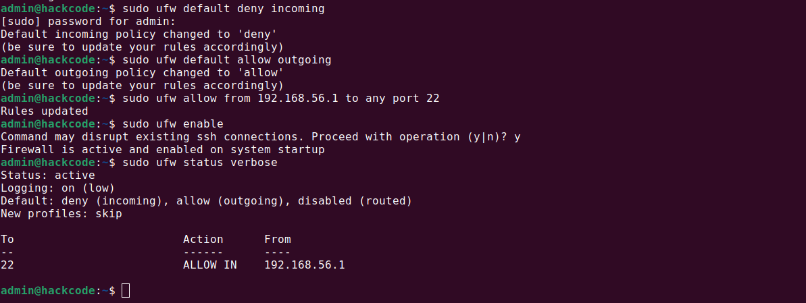
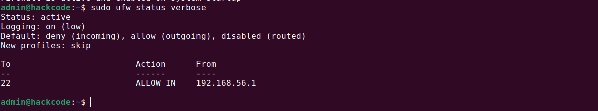

# 📘 Week 4 – Initial System Configuration & Security Implementation

---

## 1. Objectives

The objective of **Week 4** is to transition the system from a default installation state to a **secure, production-ready baseline**.

This phase focuses on **core system hardening**, specifically:

- Securing remote access using SSH best practices  
- Enforcing network-level access control via firewall rules  
- Implementing **least-privilege user access**  
- Reducing the system’s attack surface  

This week marks the **first active security enforcement phase**.

---

## 2. Principle of Least Privilege (Security Rationale)

A fundamental security principle followed in this phase is **Least Privilege**, which states:

> A user or process should have only the minimum permissions required to perform its function.

Default Linux installations often allow:

- Direct root login  
- Broad user privileges  
- Open network access  

These defaults are **unsafe for real-world deployments** and must be corrected through deliberate configuration.

---

## 3. User Management & Privilege Control

### 3.1 Creation of Non-Root Administrative User

A dedicated administrative user was created to avoid daily use of the `root` account.

```bash
sudo adduser admin
```

### 3.2 Granting Controlled Administrative Access

The `admin` user was added to the `sudo` group to allow **controlled privilege escalation**.

```bash
sudo usermod -aG sudo admin
```

This enables:

- Temporary elevation of privileges
- Command auditing via system logs
- Elimination of persistent root usage

### 3.3 Verification Command

```bash
groups admin
```

**Expected Output:**
- Output of `groups admin` showing `sudo` group membership
- Purpose: Verification of privilege assignment


- Output of groups admin
- Purpose: Verification of privilege assignment

---

## 4. SSH Hardening & Secure Remote Access
----------------------------------------

SSH is the **primary remote access vector**, making it a high-value attack surface.

### 4.1 Disable Root Login Over SSH

Allowing root login over SSH is a **critical security risk**.

The SSH configuration file was edited:

```bash
sudo nano /etc/ssh/sshd_config
```

Updated setting:

```
PermitRootLogin no
```

This ensures:

- Root account cannot be brute-forced remotely
- All access is tied to identifiable user accounts



- `sshd_config` showing `PermitRootLogin no`
- Purpose: Authentication hardening proof

### 4.2 Restart SSH Service

```bash
sudo systemctl restart ssh
```

- Terminal output confirming service restart
- Purpose: Configuration applied confirmation

### 4.3 SSH Login Validation

SSH access was tested using the non-root admin account.

```bash
ssh admin@<server-ip>
```



- Logged in as admin (not root)
- Purpose: Secure access validation

---

## 5. Firewall Configuration (UFW)
--------------------------------

A firewall enforces **network-level least privilege**, ensuring only required services are reachable.

### 5.1 Enable UFW Firewall

```bash
sudo ufw enable
```


- Firewall activation message
- Purpose: Network protection proof

### 5.2 Allow SSH Traffic Explicitly

Only SSH traffic was allowed through the firewall.

```bash
sudo ufw allow ssh
```

This blocks:

- All unused ports
- Unauthorized network scans
- Accidental service exposure


- UFW rules showing SSH allowed
- Purpose: Controlled access validation

### 5.3 Verify Firewall Rules

```bash
sudo ufw status verbose
```



- UFW active
- Only SSH allowed
- Purpose: Firewall enforcement confirmation

---

## 6. Security State Summary
--------------------------

After implementation, the system achieved the following security posture:

| Area | Status |
|------|--------|
| Root SSH Access | Disabled |
| Admin User | Enforced |
| Privilege Escalation | Controlled via sudo |
| Firewall | Active |
| Open Ports | SSH only |

This significantly reduces:

- Remote attack vectors
- Privilege escalation risks
- Accidental system misuse

---

## 7. Architecture Overview (Security Perspective)
------------------------------------------------

```
[ Remote Admin Machine ]
           |
      SSH (Port 22)
           |
   [ UFW Firewall ]
           |
[ Admin User (sudo access) ]
           |
   [ System Resources ]
```


- Created using draw.io / diagrams.net
- Purpose: Visual security flow explanation

---

## 8. Learning Reflection
-----------------------

This week demonstrated that **security is not a single feature, but a layered system design**.

Key takeaways:

- Root access should never be routine
- Network access must be explicitly allowed
- Secure defaults do not exist — they must be created

Implementing these controls early prevents:

- Catastrophic misconfigurations
- Reactive security fixes later
- Untraceable system changes

This phase establishes a **strong foundation** for advanced hardening, intrusion detection, and performance testing in the coming weeks.