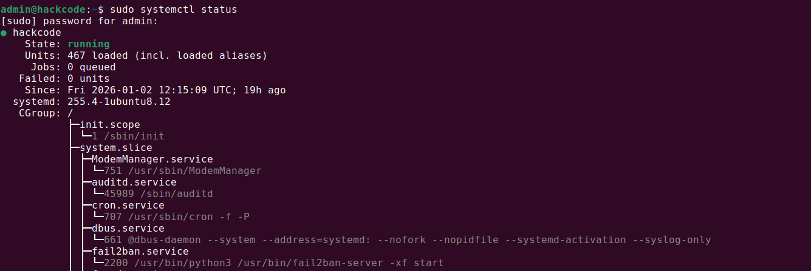
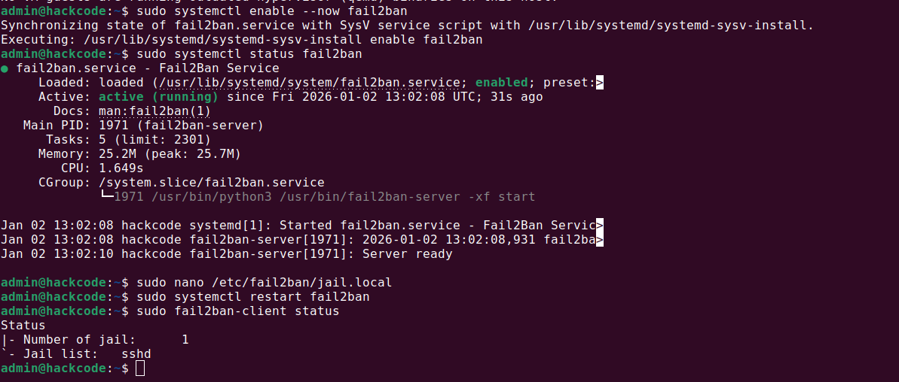
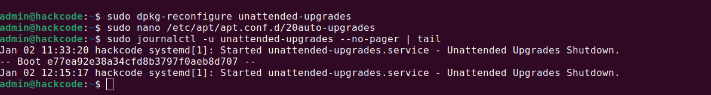

# 📘 Week 5 – Advanced Security and Monitoring Infrastructure

---

## 1. Objectives

The objective of **Week 5** is to strengthen the system’s security posture by introducing **active defense and automated maintenance mechanisms**.

This phase focuses on:

- Implementing **intrusion detection and prevention**
- Enabling **automatic security updates**
- Verifying and validating **access control mechanisms**
- Moving from *static hardening* to *dynamic security enforcement*

This week represents a shift from **preventive security** to **responsive and self-maintaining security**.

---

## 2. Need for Advanced Security Controls

While firewall rules and SSH hardening reduce the attack surface, they **do not actively respond to attacks**.

Real-world servers face:
- Repeated SSH brute-force attempts
- Credential stuffing
- Automated bot scans

To counter this, the system must:
- Detect suspicious behavior
- React automatically
- Minimize administrator intervention

---

## 3. Intrusion Detection with Fail2Ban

### 3.1 Overview of Fail2Ban

**Fail2Ban** is an intrusion prevention tool that:

- Monitors log files for suspicious activity
- Detects repeated authentication failures
- Automatically bans offending IP addresses using firewall rules

It is especially effective against **SSH brute-force attacks**.

---

### 3.2 Installation and Activation of Fail2Ban

Fail2Ban was installed and enabled to start automatically at boot.

```bash
sudo apt update
sudo apt install fail2ban -y
sudo systemctl enable --now fail2ban
```

### 3.3 Verification of Fail2Ban Status

The service status was verified to ensure proper operation.

```bash
sudo systemctl status fail2ban
```

Expected outcome:

- Service status: active (running)
- No startup errors

📸 **Screenshot 1 – Fail2Ban Service Status**

- Active service output
- Purpose: Operational verification

### 3.4 SSH Jail Verification

Fail2Ban uses _jails_ to protect individual services. The default SSH jail was verified.

```bash
sudo fail2ban-client status sshd
```

This confirms:

- SSH monitoring is active
- Ban thresholds are enforced
- IP blocking is functional

📸 **Screenshot 2 – SSH Jail Status**

- Output showing monitored failures and bans
- Purpose: SSH protection validation

---

## 4. Automatic Security Updates
------------------------------

### 4.1 Importance of Automated Updates

Unpatched systems are one of the **most common causes of security breaches**.

Manual updates:

- Are error-prone
- Depend on administrator availability
- Do not scale in production environments

Automated updates ensure:

- Timely application of security patches
- Reduced vulnerability exposure window
- Consistent system hygiene

### 4.2 Enabling Unattended Upgrades

The unattended-upgrades package was installed and enabled.

```bash
sudo apt install unattended-upgrades -y
sudo dpkg-reconfigure unattended-upgrades
```

Configuration ensures:

- Security updates are applied automatically
- Critical patches do not require manual approval



- Enabled confirmation screen
- Purpose: Automated patching proof

### 4.3 Verification of Update Configuration

```bash
cat /etc/apt/apt.conf.d/20auto-upgrades
```

Expected entries:

- Automatic package list updates
- Automatic upgrade execution


- Configuration file contents
- Purpose: Update automation verification

---

## 5. Access Control Verification
-------------------------------

### 5.1 SSH Access Validation

After implementing:

- SSH hardening
- Firewall rules
- Fail2Ban

SSH access was revalidated using the non-root admin account.

```bash
ssh admin@<server-ip>
```

This confirms:

- Root login remains disabled
- Legitimate users retain access
- Security controls do not block valid administration

- Successful login as admin
- Purpose: Access continuity verification

---

## 6. Security State Summary
--------------------------

After Week 5 implementation, the system security posture is as follows:

| Security Component | Status |
|--------------------|--------|
| SSH Root Login | Disabled |
| Firewall (UFW) | Active |
| Intrusion Detection | Fail2Ban Enabled |
| Automated Updates | Enabled |
| Admin Access | Verified |

This configuration significantly improves:

- Resistance to brute-force attacks
- Patch management reliability
- Overall system resilience

---

## 7. Architecture Overview (Security & Monitoring)
-------------------------------------------------

```
[ Attacker / Internet ]
          |
   Repeated SSH Attempts
          |
  [ Fail2Ban Monitoring ]
          |
  [ UFW Firewall Rules ]
          |
     [ SSH Daemon ]
          |
[ Admin User (sudo access) ]
          |
   [ System Resources ]
```


## 8. Learning Reflection
-----------------------

This week reinforced the idea that **security must be continuous and automated**.

Key learnings include:

- Preventive controls alone are insufficient
- Systems must detect and respond to attacks in real time
- Automation reduces human error and response delay

By integrating **Fail2Ban** and **automatic updates**, the system now:

- Actively defends itself
- Maintains security posture over time
- Requires minimal manual intervention

This phase lays the groundwork for **mandatory access control, monitoring analytics, and performance impact analysis** in the following weeks.