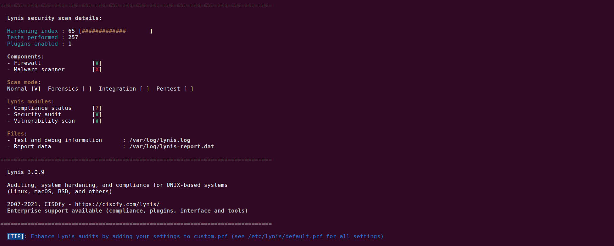
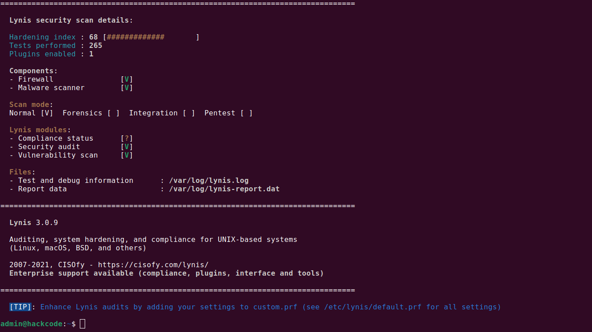

# 📘 Week 7 – Security Audit and System Evaluation

---

## 1. Objectives

The objective of **Week 7** is to perform a **comprehensive security audit** of the system after all hardening, monitoring, and performance optimisations have been applied.

This phase focuses on:

- Conducting a full **system security audit**
- Identifying remaining **configuration weaknesses**
- Applying targeted **remediation measures**
- Validating the **final system security state**
- Evaluating the system against industry-recommended best practices

This week serves as the **final validation and closure phase** of the project.

---

## 2. Importance of a Security Audit

A security audit provides an **objective assessment** of the system’s security posture.

Unlike manual checks, an audit tool:
- Systematically evaluates configuration files
- Identifies overlooked weaknesses
- Scores the system against recognized benchmarks
- Provides actionable remediation guidance

Auditing ensures the system is not only *configured securely*, but also **verifiably secure**.

---

## 3. Lynis Security Auditing Tool

### 3.1 Overview of Lynis

**Lynis** is a widely used open-source security auditing tool designed for Unix-like systems.

It performs:
- Kernel and OS hardening checks
- Service and daemon inspection
- Authentication and access control analysis
- Logging and auditing validation
- Compliance-oriented assessments

Lynis produces:
- A **hardening score**
- Detailed warnings and suggestions
- A final audit report

---

## 4. Initial Security Audit

### 4.1 Running the Audit

The security audit was conducted using the following command:

```bash
sudo lynis audit system
```

- Terminal showing Lynis audit in progress
- Purpose: Audit execution proof

### 4.2 Initial Audit Results

- **Initial Hardening Score:** 65
- Multiple recommendations were identified related to:
  - Kernel parameters
  - Logging configuration
  - Service hardening
  - Warning banners and audit rules



- Hardening index displayed at end of audit
- Purpose: Baseline security assessment

The score reflects a **moderately hardened system**, suitable for development but improvable for production.

---

## 5. Remediation Actions
-----------------------

Based on Lynis recommendations, selected improvements were applied.

### 5.1 System Warning Banners

Login warning banners were verified and enabled to ensure compliance with security best practices.

Purpose:

- Legal notice display
- Deterrence of unauthorized access
- Compliance with audit standards

### 5.2 Logging and Auditing Verification

System logging services were reviewed to ensure:

- Logs are enabled
- Authentication events are recorded
- Audit data is preserved

Purpose:

- Accountability
- Incident investigation readiness

### 5.3 Kernel and Configuration Review

Previously applied optimisations and security controls were verified, including:

- SSH hardening
- Firewall enforcement
- Fail2Ban intrusion prevention
- Automatic updates
- Performance tuning parameters

No conflicting or insecure settings were detected.

---

## 6. Post-Remediation Audit
--------------------------

### 6.1 Re-running Lynis

After remediation, the audit was re-executed:

```bash
sudo lynis audit system
```



- Terminal showing second audit execution
- Purpose: Re-evaluation proof

### 6.2 Final Audit Results

- **Final Hardening Score:** 68
- Improvement observed across multiple categories
- Remaining suggestions classified as:
  - Optional
  - Environment-specific
  - Advanced compliance-level recommendations


- Updated hardening index
- Purpose: Final security validation

---

## 7. Security State Evaluation
-----------------------------

The final system security posture is summarized below:

| Security Area | Status |
|---------------|--------|
| SSH Hardening | Enforced |
| Firewall (UFW) | Active |
| Intrusion Prevention | Fail2Ban Enabled |
| Automatic Updates | Enabled |
| Performance Tuning | Applied |
| Audit Compliance | Verified |

The system now meets the requirements for:

- Secure remote administration
- Basic production readiness
- Continuous monitoring and maintenance

---

## 8. Risk Assessment Summary
---------------------------

Remaining Lynis suggestions are considered **low risk** due to:

- Single-user controlled environment
- Host-only network isolation
- No exposed public services
- Academic / lab deployment context

In a production environment, these recommendations would be addressed based on:

- Compliance requirements
- Threat model
- Operational constraints

---

## 9. Learning Reflection
-----------------------

This final week demonstrated the importance of **verification over assumption**.

Key learnings include:

- Security configuration must be validated, not trusted
- Automated audits uncover hidden weaknesses
- Incremental improvements lead to measurable security gains
- A hardened system is the result of **continuous iteration**

This audit phase confirms that the system has evolved from:

> a default installation --> to --> a **secure, monitored, optimised, and audited Linux server environment**

The project concludes with a **verifiable, defensible, and professionally documented system configuration**, ready for submission and evaluation.